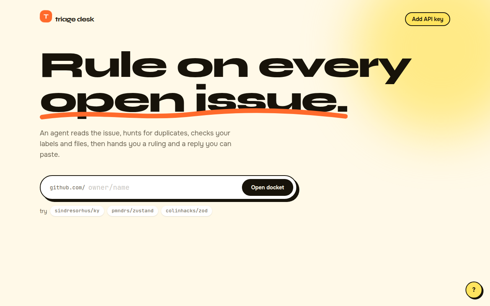
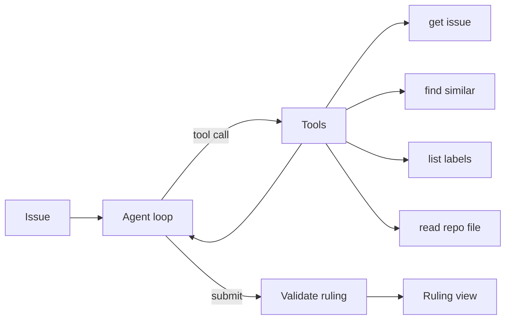
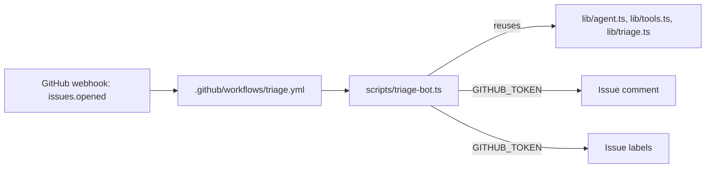

<div align="center">

# triage-desk

**An agent that investigates open GitHub issues with tools, then rules on them.**

[](LICENSE)
[](https://nextjs.org)
[](https://www.typescriptlang.org)
[](https://triage-desk-iota.vercel.app)

[Live demo](https://triage-desk-iota.vercel.app) | [Quick start](#quick-start) | [How it works](#how-it-works) | [Docs](#documentation)



</div>

## Try it

Open **https://triage-desk-iota.vercel.app**, enter any public `owner/name` repository (or click one of the suggested examples) and open the docket. Ruling needs your own Anthropic or OpenAI API key, entered in the app (see [Privacy](#data-flow-and-privacy)).

1. Enter `owner/name` and press **Open docket**.
2. Select an issue and press `R`, or press `B` to triage the next five.
3. Copy the suggested reply with `C`, or export all rulings as JSON.

## Features

- **Investigates before ruling.** The agent calls tools (get issue, find similar issues, list labels, read a repo file) before it decides.
- **Structured ruling.** Kind, priority, labels, duplicate, missing information, a reply you can paste, and confidence.
- **Auditable.** A timeline shows every tool call the agent made.
- **Fast to drive.** Keyboard shortcuts, batch triage of five issues, JSON export.
- **Read-only in the browser.** The browser app never writes to GitHub; a human applies the ruling. The CI bot below is the one exception, scoped to its own workflow token.
- **Bring your own key.** Anthropic or OpenAI, entered in the browser. No server, no environment variables.
- **Runs unattended too.** A GitHub Actions bot (`scripts/triage-bot.ts`) triages every new issue automatically — see [Production usage](#production-usage).

## How it works



The page builds an adapter for the chosen provider and runs the loop with the open issues as context. Each tool call is reported as a step. The loop ends when `submit_triage` passes validation. Full diagrams and the module map are in [docs/architecture.md](docs/architecture.md).

## Quick start

Requires Node 22 or newer.

```bash
git clone https://github.com/edgeorgie/triage-desk.git
cd triage-desk
npm ci
npm run dev
```

Open http://localhost:3000. There are no environment variables: click **Add API key**, choose Anthropic or OpenAI and paste your key. The key stays in your browser.

[](https://vercel.com/new/clone?repository-url=https%3A%2F%2Fgithub.com%2Fedgeorgie%2Ftriage-desk)

## Data flow and privacy

| Data | Where it goes | Stored |
|---|---|---|
| Repository issues | Fetched from GitHub in the browser | Memory only |
| Issue text and tool results | Sent to the chosen model provider | Not stored |
| Provider key | Sent only to the provider | `sessionStorage` by default; `localStorage` only if you choose to remember it on this device |
| Rulings | Kept in memory, exported on request | Not stored |

Issue text is untrusted input to an agent with tools. Blast radius is limited: tools are read-only, file paths are guarded, the loop is capped at 8 steps and the ruling is schema-validated. A hostile issue could still mislead the ruling, so a human applies it.

## Production usage

Beyond the browser demo, this repo ships a **headless agent bot** that runs autonomously —
no human click, no browser, no manually-entered key for the GitHub actions it takes.



- **Trigger:** a real GitHub webhook (`issues: [opened]`, also `pull_request_target: [opened]`), delivered by GitHub itself when anyone opens an issue — not a manual run.
- **Logic reuse:** `scripts/triage-bot.ts` imports the exact same `lib/agent.ts` agent loop, `lib/tools.ts` tools and `lib/triage.ts` schema the browser UI uses; it just swaps the browser's `fetch`-based "paste your key" flow for a Node/CI environment.
- **Writes to GitHub autonomously:** the workflow's built-in `GITHUB_TOKEN` is enough to post a triage comment and apply labels — no new secret required for that part.
- **LLM reasoning (optional):** if `ANTHROPIC_API_KEY` or `OPENAI_API_KEY` is present as a repository secret (Settings → Secrets and variables → Actions), the bot calls that provider for the kind/priority/duplicate/reply reasoning, same as the browser app.
- **Heuristic fallback (documented, no fabricated LLM usage):** with neither secret configured, `scripts/triage-bot.ts` runs a deterministic, keyword/overlap-based triage (see `heuristicTriage` in the script) so the full pipeline — trigger → investigate → comment → label — still produces real output end-to-end, clearly labeled `_Automated heuristic triage (no LLM key configured)_` in the posted comment.
- **Evidence this actually runs, not just "should run":**
  - Example run (triggered by the real `issues.opened` webhook, 22s, green): https://github.com/edgeorgie/triage-desk/actions/runs/37983913473
  - Example issue the bot triaged on its own: https://github.com/edgeorgie/triage-desk/issues/26
  - Example comment it posted: https://github.com/edgeorgie/triage-desk/issues/26#issuecomment-6088283797
  - Labels it applied autonomously: `feature`, `p3`
  - Each run also writes `triage-logs/runs.jsonl` and `triage-logs/last-run.json`, uploaded as a workflow artifact (`triage-log-<run id>`) on every run — a machine-readable record alongside the human-readable Actions log.
- **To enable LLM-grade triage:** add an `ANTHROPIC_API_KEY` (or `OPENAI_API_KEY`) secret under *Settings → Secrets and variables → Actions*. No code changes needed; the bot detects it automatically and switches modes.
- I built the webhook-triggered bot, see [PR #25](https://github.com/edgeorgie/triage-desk/pull/25). I wired eval-lab into this repo's own CI to test the bot's real triage logic, see [PR #27](https://github.com/edgeorgie/triage-desk/pull/27).

## By the numbers

- 22s — webhook-to-comment latency, real run: [triage-desk/actions/runs/37983913473](https://github.com/edgeorgie/triage-desk/actions/runs/37983913473)
- 83.3% (15/18) — kind classification accuracy, self-labeled benchmark ([ACCURACY.md](ACCURACY.md))
- 83.3% (15/18) — priority classification accuracy, same benchmark
- 1/2 (50%) — duplicate detection rate on the same benchmark (near-verbatim caught, paraphrase missed)
- 0.274ms → ~0.03ms — heuristic triage latency per case, cold vs. JIT-warmed
- 6/6 — eval-lab eval cases passing against this bot's real heuristic logic in CI ([run 37987251361](https://github.com/edgeorgie/triage-desk/actions/runs/37987251361))
- 22/22 — local unit tests passing (`npm test`)

## Limits

- Public repositories only; 60 unauthenticated GitHub calls per hour.
- Token overlap misses paraphrased duplicates.
- The agent never writes to GitHub.

## Tech stack

Next.js 16 (App Router), React 19, TypeScript, Tailwind CSS 4. Client-side only; no backend. Models: Anthropic `claude-haiku-4-5-20251001` or OpenAI `gpt-4o-mini`.

## Scripts

| Script | Purpose |
|---|---|
| `npm run dev` | Development server |
| `npm run build` | Production build |
| `npm run typecheck` | TypeScript check |
| `npm run lint` | ESLint |
| `npm test` | Unit tests |
| `npm run spec:check` | Traceability gate |
| `npm run verify` | All of the above |
| `npm run deploy:pages` | Static export to the `gh-pages` branch |
| `npm run triage-bot` | Headless triage for one issue (used by `.github/workflows/triage.yml`) |

## Deployment

The app is fully client-side, so it can be hosted as static files.

- **GitHub Pages:** `npm run deploy:pages` builds a static export and publishes it to the `gh-pages` branch. Enable Pages from that branch; on a free plan the repository must be public.
- **Vercel or any Node host:** use the Deploy button above. No configuration is needed.

## Key concepts

| Term | Meaning |
|---|---|
| Agent loop | Repeat: ask the model, run the tools it requests, feed back results, until it submits. |
| Tool use | The model returns structured calls to named functions instead of free text. |
| Terminal tool | submit_triage: the call that ends the loop and carries the structured ruling. |
| Ruling | The validated decision: kind, priority, labels, duplicate, missing information, reply, confidence. |
| Duplicate detection | Ranking similar open issues by token overlap computed locally. |
| Step budget | The loop stops after 8 steps if no ruling is submitted. |

## Design system

Typography: Display, Syne; Text, Onest; Code, JetBrains Mono.

| Token | Value | Use |
|---|---|---|
| `cream` | `#fff9e8` | Page background |
| `ink` | `#17130a` | Text and ruling card |
| `tangerine` | `#ff6a2b` | Primary action |
| `lemon` | `#ffe45e` | Highlights |
| `mint` | `#19b47a` | Positive |
| `rose` | `#ef4565` | Errors and bugs |

- Make the agent's work visible and auditable.
- Chunky borders and offset shadows for a tactile feel.

Motion, components and rationale: [docs/design-system.md](docs/design-system.md).

## Documentation

| Document | What it answers |
|---|---|
| [docs/index.md](docs/index.md) | Map of all documentation |
| [docs/architecture.md](docs/architecture.md) | Diagrams and modules |
| [docs/spec/spec.md](docs/spec/spec.md) | Requirements and acceptance criteria |
| [docs/spec/traceability.md](docs/spec/traceability.md) | Requirement to code, test and evidence |
| [docs/design-system.md](docs/design-system.md) | Tokens, motion, components |
| [docs/glossary.md](docs/glossary.md) | Definitions |
| [docs/evaluation.md](docs/evaluation.md) | Self-assessment against a review rubric |
| [docs/adr](docs/adr) | Decision records |

## For AI agents and tools

- [AGENTS.md](AGENTS.md) defines the workflow and quality gates for agents and people.
- [llms.txt](public/llms.txt) is served at `/llms.txt` when deployed and points to the key documents.
- [docs/spec/requirements.json](docs/spec/requirements.json) is the machine-readable requirement list with status, files and tests.
- `npm run verify` is the single deterministic gate: typecheck, lint, traceability check, tests and build.

## Contributing

See [CONTRIBUTING.md](CONTRIBUTING.md). Security reports: [SECURITY.md](SECURITY.md).

## License

[MIT](LICENSE)
