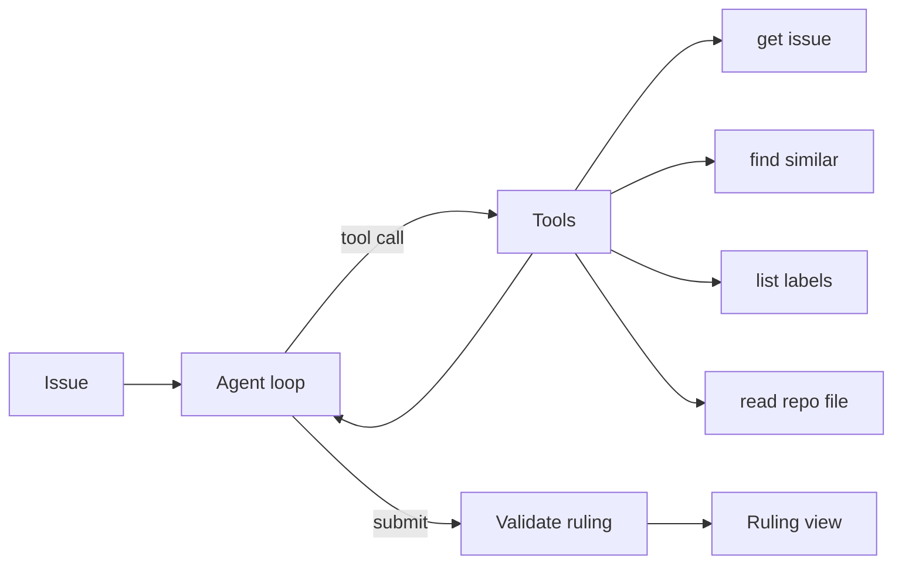

# triage-desk

An agent that investigates open GitHub issues with tools and rules on them.

- An agent that investigates an issue with tools before ruling
- Structured ruling: kind, priority, labels, duplicate, missing information and a reply
- A timeline of every tool call for auditing
- Keyboard shortcuts, batch triage of five issues and JSON export
- Read-only by design

## Try it

**Live demo:** https://triage-desk-iota.vercel.app

[](https://vercel.com/new/clone?repository-url=https%3A%2F%2Fgithub.com%2Fedgeorgie%2Ftriage-desk)

```bash
npm install
npm run dev
```

Open http://localhost:3000. Requires Node 22 or newer.

1. Enter owner/name and open the docket.
2. Select an issue and press R, or B to triage the next five.
3. Copy the suggested reply with C or export all rulings.

## Configuration

No environment variables. API keys are entered in the app and stay in the browser.

## How it works



The page builds an adapter for the chosen provider and runs the loop with the open issues as context. Each tool call is reported as a step. The loop ends when submit_triage passes validation. Full diagrams and the module map are in [docs/architecture.md](docs/architecture.md).

## Key concepts

| Term | Meaning |
|---|---|
| Agent loop | Repeat: ask the model, run the tools it requests, feed back results, until it submits. |
| Tool use | The model returns structured calls to named functions instead of free text. |
| Terminal tool | submit_triage: the call that ends the loop and carries the structured ruling. |
| Ruling | The validated decision: kind, priority, labels, duplicate, missing information, reply, confidence. |
| Duplicate detection | Ranking similar open issues by token overlap computed locally. |
| Step budget | The loop stops after 8 steps if no ruling is submitted. |

## Design system

Typography: Display, Syne; Text, Onest; Code, JetBrains Mono.

| Token | Value | Use |
|---|---|---|
| `cream` | `#fff9e8` | Page background |
| `ink` | `#17130a` | Text and ruling card |
| `tangerine` | `#ff6a2b` | Primary action |
| `lemon` | `#ffe45e` | Highlights |
| `mint` | `#19b47a` | Positive |
| `rose` | `#ef4565` | Errors and bugs |

- Make the agent's work visible and auditable.
- Chunky borders and offset shadows for a tactile feel.

Motion, components and rationale: [docs/design-system.md](docs/design-system.md).

## Data flow and privacy

| Data | Where it goes | Stored |
|---|---|---|
| Repository issues | Fetched from GitHub in the browser | Memory only |
| Issue text and tool results | Sent to the chosen model provider | Not stored |
| Provider key | localStorage, sent only to the provider | This browser |
| Rulings | Kept in memory, exported on request | Not stored |

## Limits

- Public repositories only; 60 unauthenticated GitHub calls per hour.
- Token overlap misses paraphrased duplicates.
- The agent never writes to GitHub.

## Deployment

The app is fully client-side, so it can be hosted as static files.

- **GitHub Pages:** `npm run deploy:pages` builds a static export and publishes it to the `gh-pages` branch. Enable Pages from that branch; on a free plan the repository must be public.
- **Vercel or any Node host:** use the Deploy button above. No configuration is needed.

## Documentation

| Document | What it answers |
|---|---|
| [docs/index.md](docs/index.md) | Map of all documentation |
| [docs/architecture.md](docs/architecture.md) | Diagrams and modules |
| [docs/spec/spec.md](docs/spec/spec.md) | Requirements and acceptance criteria |
| [docs/spec/traceability.md](docs/spec/traceability.md) | Requirement to code, test and evidence |
| [docs/design-system.md](docs/design-system.md) | Tokens, motion, components |
| [docs/glossary.md](docs/glossary.md) | Definitions |
| [docs/evaluation.md](docs/evaluation.md) | Self-assessment against a review rubric |
| [docs/adr](docs/adr) | Decision records |

## For AI agents and tools

- [AGENTS.md](AGENTS.md) defines the workflow and quality gates for agents and people.
- [llms.txt](public/llms.txt) is served at `/llms.txt` when deployed and points to the key documents.
- [docs/spec/requirements.json](docs/spec/requirements.json) is the machine-readable requirement list with status, files and tests.
- `npm run verify` is the single deterministic gate: typecheck, lint, traceability check, tests and build.

LLM integration: Issue text is untrusted input to an agent with tools. Blast radius is limited: tools are read-only, file paths are guarded, the loop is capped at 8 steps and the ruling is schema-validated. A hostile issue could still mislead the ruling, so a human applies it.

## Scripts

| Script | Purpose |
|---|---|
| `npm run dev` | Development server |
| `npm run build` | Production build |
| `npm run typecheck` | TypeScript check |
| `npm run lint` | ESLint |
| `npm test` | Unit tests |
| `npm run spec:check` | Traceability gate |
| `npm run verify` | All of the above |

## Contributing

See [CONTRIBUTING.md](CONTRIBUTING.md). Security reports: [SECURITY.md](SECURITY.md).

## License

MIT.
