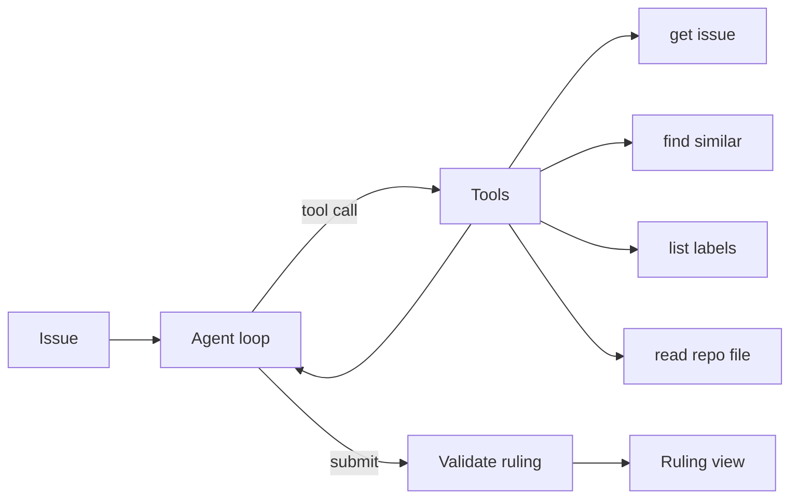
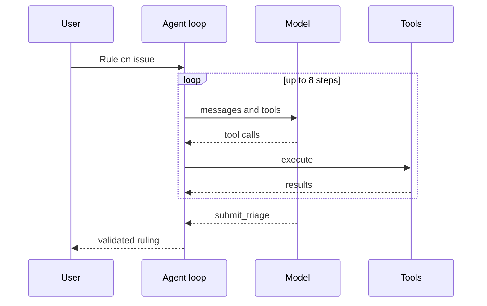

# Architecture

## Data flow

## Main sequence

## Modules

| Path | Responsibility |
|---|---|
| `lib/agent.ts` | Loop, prompts and provider adapters |
| `lib/tools.ts` | Tool definitions and executor |
| `lib/triage.ts` | Ruling schema and validation |
| `lib/similar.ts` | Duplicate ranking |
| `lib/github.ts` | Issue listing and file reads |
| `components/` | Ledger and ruling |

## Principles

- Pure logic lives in `lib/` and is tested without a browser; components stay thin.
- Network, storage and model replies are validated at the boundary.
- Secrets and user content stay in the browser.

## Decisions

- [Terminal tool for structured output](adr/0001-terminal-tool-for-structured-output.md)
- [Read-only agent](adr/0002-read-only-agent.md)
